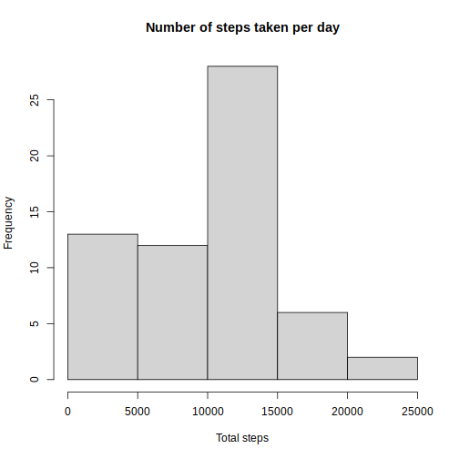
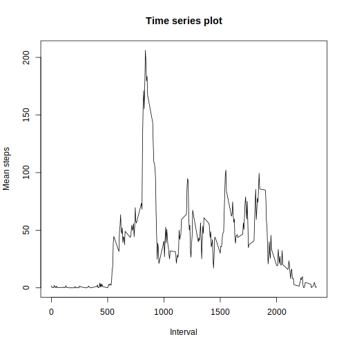
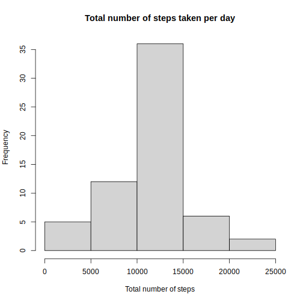
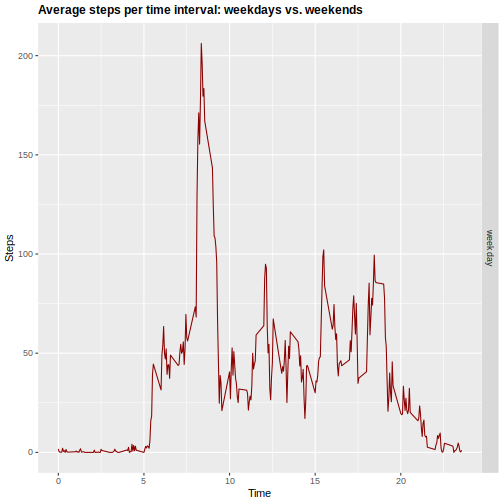

# Loading and preprocessing


```r
library(ggplot2)
library(dplyr)
```


### 1.- Load the dataset


```r
if(!file.exists('activity.csv')){
    unzip('activity.zip')
}
data <- read.csv("activity.csv", header = T)
str(data)
```

```
## 'data.frame':	17568 obs. of  3 variables:
##  $ steps   : int  NA NA NA NA NA NA NA NA NA NA ...
##  $ date    : chr  "2012-10-01" "2012-10-01" "2012-10-01" "2012-10-01" ...
##  $ interval: int  0 5 10 15 20 25 30 35 40 45 ...
```

### 2.- Remove NA in the dataset


```r
debugged <- data[with(data, {!(is.na(steps))}),]
head(debugged)
```

```
##     steps       date interval
## 289     0 2012-10-02        0
## 290     0 2012-10-02        5
## 291     0 2012-10-02       10
## 292     0 2012-10-02       15
## 293     0 2012-10-02       20
## 294     0 2012-10-02       25
```

```r
dim(debugged)
```

```
## [1] 15264     3
```

# What is mean total number of steps taken per day?

### 1.- Calculate the total number of steps taken per day


```r
totalSteps <- with(data, tapply(steps, as.factor(data$date), sum, na.rm = T))
```

### 2.- Make a histogram of the total number of steps taken each day


```r
hist(totalSteps, main = "Number of steps taken per day", xlab = "Total steps")
```



### 3.- Calculate and report the mean and median of the total number of steps taken per day


```r
summary(totalSteps)
```

```
##    Min. 1st Qu.  Median    Mean 3rd Qu.    Max. 
##       0    6778   10395    9354   12811   21194
```
# What is the average daily activity pattern?

### 1.- Make a time series plot (i.e. type = “l”) of the 5-minute interval (x-axis) and the average number of steps taken, averaged across all days (y-axis) 


```r
timeSerie <- with(debugged, tapply(steps, debugged$interval, mean))
minute <- levels(as.factor(debugged$interval))
plot(minute, timeSerie, type = "l", main = "Time series plot", xlab = "Interval",
ylab = "Mean steps")
```




### 2.- Which 5-minute interval, on average across all the days in the dataset, contains the maximum number of steps?


```r
mat <- data.frame(timeSerie, minute)
mat[mat$timeSerie==max(mat$timeSerie),][2]
```

```
##     minute
## 835    835
```

# Imputing missing values

### 1.- Calculate and report the total number of missing values in the dataset (i.e. the total number of rows with NAs)


```r
missingData <- data[is.na(data$steps),]
length(missingData$steps)
```

```
## [1] 2304
```


### 2.- Devise a strategy for filling in all of the missing values in the dataset. The strategy does not need to be sophisticated. For example, you could use the mean/median for that day, or the mean for that 5-minute interval, etc.


```r
meanDay <- with(debugged, tapply(steps, debugged$interval, mean))
missingData$steps <- meanDay
```


### 3.- Create a new dataset that is equal to the original dataset but with the missing data filled in.


```r
newDataset <- rbind(debugged, missingData)
newDataset <- newDataset[order(newDataset$date),]
```


### 4.- Make a histogram of the total number of steps taken each day and calculate and report the mean and median total number of steps taken per day. Do these values differ from the estimates from the first part of the assignment? What is the impact of imputing missing data on the estimates of the total daily number of steps?


```r
totalNumber <- with(newDataset, tapply(steps, as.factor(newDataset$date), sum))
hist(totalNumber, main = "Total number of steps taken per day", 
xlab = "Total number of steps")
```




### 5.- Calculate and report the mean and median of the total number of steps taken per day.

Mean and median total number of steps taken per day WITHOUT filling in the missing values


```r
summary(totalSteps)
```

```
##    Min. 1st Qu.  Median    Mean 3rd Qu.    Max. 
##       0    6778   10395    9354   12811   21194
```


Mean and median total number of steps taken per day WITH filling in the missing values


```r
summary(totalNumber)
```

```
##    Min. 1st Qu.  Median    Mean 3rd Qu.    Max. 
##      41    9819   10766   10766   12811   21194
```


# Are there differences in activity patterns between weekdays and weekends?


### 1.- Create a new factor variable in the dataset with two levels - “weekday” and “weekend” indicating whether a given date is a weekday or weekend day.


```r
newDataset$days <- as.Date(newDataset$date, format = "%Y-%m-%d")
newDataset$weekDay <- weekdays(newDataset$days)
newDataset$dayType <- ifelse(newDataset$weekDay=="Saturday" 
| newDataset$weekDay=="Sunday", "weekend", "week day")
head(newDataset, n=10)
```

```
##        steps       date interval       days weekDay  dayType
## 1  1.7169811 2012-10-01        0 2012-10-01   lunes week day
## 2  0.3396226 2012-10-01        5 2012-10-01   lunes week day
## 3  0.1320755 2012-10-01       10 2012-10-01   lunes week day
## 4  0.1509434 2012-10-01       15 2012-10-01   lunes week day
## 5  0.0754717 2012-10-01       20 2012-10-01   lunes week day
## 6  2.0943396 2012-10-01       25 2012-10-01   lunes week day
## 7  0.5283019 2012-10-01       30 2012-10-01   lunes week day
## 8  0.8679245 2012-10-01       35 2012-10-01   lunes week day
## 9  0.0000000 2012-10-01       40 2012-10-01   lunes week day
## 10 1.4716981 2012-10-01       45 2012-10-01   lunes week day
```


### 2.- Make a panel plot containing a time series plot (i.e. type = “l”) of the 5-minute interval (x-axis) and the average number of steps taken, averaged across all weekday days or weekend days (y-axis). See the README file in the GitHub repository to see an example of what this plot should look like using simulated data.


```r
tablePerTime <- aggregate(steps~interval+dayType,data=newDataset,FUN=mean,na.action=na.omit)
tablePerTime$time <- tablePerTime$interval/100
j <- ggplot(tablePerTime, aes(time, steps))
j+geom_line(col="darkred")+ggtitle("Average steps per time interval: weekdays vs. weekends")+xlab("Time")+ylab("Steps")+theme(plot.title = element_text(face="bold", size=12))+facet_grid(dayType ~ .)
```




